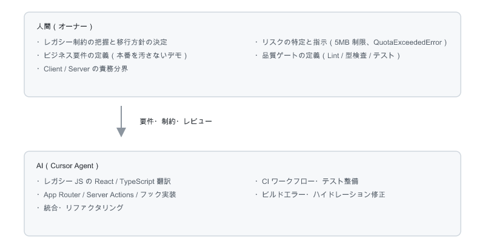

# AGENT.md — AI-Driven Legacy Migration 実証記録

## このドキュメントの目的

本ドキュメントは、[portfolio](https://github.com/expogewinnt/portfolio)（Vanilla JS / 静的 HTML）から本リポジトリ（Next.js App Router）への **レガシーマイグレーション** を、**AI 駆動開発（Cursor / Claude）** で進めた過程の記録です。

> AI を「コード生成ツール」ではなく、**アーキテクチャの壁打ち・移行ディレクションのパートナー** として使い、要件定義から実装・品質担保まで一貫して進めた実証実験です。

**人間が何を判断し、AI が何を実行したか** を透明化するための記録です。

| 比較 | URL |
|---|---|
| レガシー（移行前） | [expogewinnt.github.io/portfolio/](https://expogewinnt.github.io/portfolio/) / [portfolio](https://github.com/expogewinnt/portfolio) |
| モダン（移行後） | [portfolio-react-202607.vercel.app/](https://portfolio-react-202607.vercel.app/) / [portfolio-react](https://github.com/expogewinnt/portfolio-react) |

---

## 開発アプローチの概要

---

## 1. レガシーコードの解析と設計方針の策定

### 移行の出発点

レガシー版（[expogewinnt/portfolio](https://github.com/expogewinnt/portfolio)）は GitHub Pages 上で動作する **静的サイト** です。ビルドツール・フレームワーク・パッケージマネージャーは使わず、`index.html` + `css/` + `js/` + `json/data.json` + `img/` で構成されています。

- **UA 判定** で PC / SP の表示ロジックを切り替え（`pc.min.js` / `sp.min.js`）
- **PC 版**: サムネイル一覧 + hash ナビによる拡大ビュー（`setInterval` による横スクロール追従）
- **SP 版**: Swiper.js によるスライドギャラリー
- **データ取得**: `XMLHttpRequest` で `json/data.json` を読み込み

移行の第一目標は **見た目と操作感の互換維持**、第二目標は Next.js 上での **責務分離と拡張**（管理画面・デモモード）でした。

### AI への読み込みと翻訳プロセス

1. レガシーリポジトリの HTML / CSS / JS を AI にコンテキストとして投入
2. 「どの処理がブラウザ API 依存か」を洗い出し、Server / Client の境界を人間が確定
3. AI に TypeScript 化とコンポーネント分割を委譲し、人間がビルド・表示・ハイドレーションをレビュー

### レガシー → Next.js マッピング表

| レガシー（[portfolio](https://github.com/expogewinnt/portfolio)） | Next.js への翻訳先 | 責務 |
|---|---|---|
| `index.html` + `css/`（PC / SP 別） | `app/globals.css` + `components/gallery-view.tsx` | クラス名（`.portfolioHeader` 等）を維持し UI 互換を確保 |
| UA 判定 → `pc.min.js` / `sp.min.js` 切り替え | `useIsMobile()` + `DesktopGallery` / `MobileGallery` | スクリプト分岐を React コンポーネント分岐へ |
| `XMLHttpRequest` で `json/data.json` 取得 | `app/page.tsx`（Server Component）→ `readWorks()` | 非同期 fetch をサーバー側データ層に置換（microCMS / local 切替） |
| `json/data.json` | `src/data/works.json`（local フォールバック）+ microCMS | スキーマ（`img` / `ttl` / `charge` ↔ `title` / `charge` / `image`）を継承 |
| `img/{big,small,sp}/` | `public/images/{big,small,sp}/` または microCMS CDN | local は 3 サイズ維持、microCMS は CDN クエリでリサイズ |
| `location.hash` + `convertHashIndex()` | `lib/gallery-view-utils.ts`（`parseHash` / `updateHash`） | ブラウザ API 依存 → `"use client"` 配下 |
| `window.onhashchange` | `gallery-view.tsx` の `useEffect` + `hashchange` リスナー | イベント登録・解除を React ライフサイクルに統合 |
| `setInterval` によるサムネイル横スクロール（`pc.min.js`） | `gallery-view.tsx` の `requestAnimationFrame` + ref | 描画ループをモダン API に置換 |
| Swiper.js スライドギャラリー（`sp.min.js`） | `MobileGallery`（タッチスワイプ） | 外部ライブラリ依存を React ネイティブ操作へ |
| `Image()` によるプリロード進捗 | `preloadImages()` in `gallery-view-utils.ts` | ローディング UI ロジックを純関数として切り出し |
| HTML エンティティの手動デコード | `decodeHtml()` in `gallery-view-utils.ts` | SSR/CSR 両対応のユーティリティ化（ハイドレーション不一致を修正） |
| （移行先で新規）本番管理 CRUD | `/admin/**` → Server Actions + `works-store.ts`（microCMS / local） | UI・認証は維持し、永続化先だけ切替 |
| （移行先で新規）デモ向け CRUD | `/demo/admin/**` → `useGalleryData` + `gallery-storage.ts` | クライアントのみ永続化（本番汚染防止） |

### Client / Server Component の切り分け判断

| 処理 | 配置 | 理由 |
|---|---|---|
| `readWorks()`（microCMS / `works.json`） | Server Component（`app/page.tsx`） | API キーとファイル I/O はサーバー専用 |
| ギャラリー表示・hash ナビ・マウス追従 | Client Component（`gallery-view.tsx`） | `window` / `history` / `requestAnimationFrame` 依存 |
| 本番 CRUD・画像アップロード | Server Actions + `works-store.ts`（`server-only`） | microCMS Media API / sharp は Node.js 専用 |
| デモ CRUD・localStorage 永続化 | Client Hook（`use-gallery-data.ts`） | ブラウザストレージはクライアント専用 |
| 本番管理の認証ガード | `proxy.ts` | `/admin` 配下への Cookie セッション検証 |

**設計上の判断**: レガシーでは UA 判定による `pc.min.js` / `sp.min.js` の分岐と、DOM 直操作が中心でした。移行先では **メディアクエリによるコンポーネント分岐** と **Server / Client の責務分離** に再編し、Swiper.js 依存は React のタッチハンドラへ置き換えました。AI は実装を担い、分割の粒度と境界は人間がレビューして確定しました。

---

## 2. 運用リスクへの先回り

移行プロジェクトでは「動くこと」以上に、**本番環境を汚さないこと** と **ブラウザ制約によるクラッシュ回避** がビジネス要件でした。  
単に「管理画面を作って」と依頼するのではなく、**運用上のリスクと技術的制約を先に言語化してから** AI とペアプログラミングで実装しました。

### Step 1 — ビジネス要件の定義（人間）

> 第三者が管理画面の操作を試せるサンドボックスモードが欲しい。  
> ただし本番の `works.json` や画像ファイルは絶対に書き換えてはいけない。

- [x] 本番（`/admin`）とデモ（`/demo/admin`）を URL で完全分離
- [x] デモはサーバーへの永続化を行わないサンドボックス構成

### Step 2 — 技術制約の明示（人間）

> データは `localStorage` に保存する。  
> ブラウザの容量上限は約 5MB なので、画像をそのまま Base64 で保存すると `QuotaExceededError` になる。  
> **対策として、アップロード時に Canvas API でリサイズ・圧縮してから保存せよ。**

AI と共に以下を実装しました。

| ファイル | 役割 |
|---|---|
| `lib/gallery-constants.ts` | `IMAGE_MAX_WIDTH`（720）/ `IMAGE_JPEG_QUALITY`（0.7）/ `DEMO_WORKS_LIMIT`（20）の定数化 |
| `lib/gallery-image.ts` | `createImageBitmap` → Canvas 描画 → `toDataURL("image/jpeg")` |
| `lib/gallery-storage.ts` | read / write / seed / reset |
| `hooks/use-gallery-data.ts` | `persist()` 内の `QuotaExceededError` 捕捉とユーザー向けエラーメッセージ |

### Step 3 — エッジケースの潰し込み（人間 ↔ AI）

| 判断 | 経緯 |
|---|---|
| 初期シード件数: 10 → **20** | デモ体験で十分な作品数を確保するため。localStorage 容量とのトレードオフを認識したうえで決定 |
| 圧縮横幅: 1000px → **720px** | 20 件 × Base64 でも 5MB 内に収まるよう、面積比（幅の二乗）で容量を試算 |
| 本番との分離確認 | 本番は microCMS CDN（local 時は sharp 1600px）、デモは 720px — 用途ごとに最適化が異なることを明示 |
| シード件数が反映されない | localStorage の既存データが原因と人間が切り分け。ストレージキーのバージョン管理（`portfolio_admin_gallery_demo_v1`）で対応 |

### Step 4 — 認証のリスクヘッジ（人間）

> ID/PW をリポジトリに公開しないこと。`.env.local` で簡単に変更できる形にせよ。

- [x] ハードコードされたフォールバック値を削除
- [x] 環境変数未設定時はログイン無効化
- [x] `.env.example` のみをリポジトリに含める

### Step 5 — Vercel 読み取り専用 FS への対応（人間 ↔ AI）

> 本番（Vercel）で `/admin` の更新が `EROFS: read-only file system` になる。  
> 自作管理 UI は残したまま、永続化先だけ差し替えよ（パターン B）。

**人間の判断**

| 判断 | 内容 |
|---|---|
| 方針 | UI / 認証 / デモモードは維持。本番データ層のみ microCMS へ |
| 切替条件 | `MICROCMS_SERVICE_DOMAIN` + `MICROCMS_API_KEY` あり → microCMS、なし → `works.json` + sharp |
| スキーマ | API ID `works` / `title`・`charge`・`image`（アプリ側 `ttl` / `charge` / `img` と対応） |
| 運用 | Vercel Environment Variables（Production）に同キーを設定。追加後は Redeploy が必要 |

**AI が実装した層**

| ファイル | 役割 |
|---|---|
| `lib/cms-config.ts` | 設定有無判定・Storage ラベル（`microCMS` / `works.json`） |
| `lib/microcms-client.ts` | Contents API CRUD + Media API アップロード |
| `lib/microcms-image.ts` | CDN リサイズ URL（`?w=`） |
| `lib/works-store.ts` | facade（環境変数で local / microCMS 切替） |
| `lib/works-store-local.ts` | 従来のファイル永続化 + Vercel 上での書き込み拒否 |
| `scripts/import-works-to-microcms.mjs` | 初回インポート（MIME 指定・429 リトライ・既存タイトル SKIP） |

**検証で潰したポイント**

| 症状 | 原因 | 対処 |
|---|---|---|
| Media upload `Forbidden` | API キーにメディア権限なし | マネジメント API（ベータ）で「メディアのアップロード」を許可 |
| `application/octet-stream` 拒否 | Blob に MIME 未指定 | 拡張子から `image/jpeg` 等を付与 |
| `Too Many Requests` | 連続アップロード | 間隔延長 + 指数バックオフ + 再開時 SKIP |
| 本番だけ EROFS のまま | 環境変数追加後未 Redeploy / `main` 未反映 | Production 再デプロイと Storage=`microCMS` で確認 |

デモ（`/demo` / `/demo/admin`）は localStorage のまま変更なし。詳細手順は [microcms-integration-plan.md](./microcms-integration-plan.md)。

---

## 3. 品質保証の自動化

リプレイス後は「手動確認だけ」では回帰リスクが高いため、**人間が品質ゲートを定義し、AI に CI パイプラインとテストの実装を委譲** しました。

### 品質ゲートの設計（人間）

| レイヤー | 目的 | 実行コマンド |
|---|---|---|
| **Lint** | コーディング規約・潜在的バグの早期検出 | `npm run lint` |
| **Type check** | 型安全性の担保 | `npm run typecheck` |
| **Vitest** | 純関数・ユーティリティ層の単体テスト | `npm run test` |
| **Playwright** | 公開・デモギャラリーの表示スモーク | `npm run test:e2e`（build 後） |

### AI による実装

| 成果物 | 内容 |
|---|---|
| `.github/workflows/ci.yml` | `quality` ジョブ（Lint → 型検査 → Vitest）と `e2e` ジョブ（build → Playwright）の 2 段構成 |
| `lib/gallery-utils.test.ts` | HTML エスケープ・デモ初期データ件数・画像パス解決のテスト（5 本） |
| `lib/site-title-utils.test.ts` | サイトタイトルサニタイズのテスト（6 本） |
| `e2e/smoke.spec.ts` | `/` と `/demo` で `.portfolioHeader` が表示されることを検証（1 本） |

### テスト戦略の判断

デモモードは `localStorage` / Canvas API への依存が強いため、**Vitest ではロジック層、Playwright では実ブラウザ上の動作** を分担検証する方針を人間が定め、AI がそれぞれのテストコードを実装しました。

| ジョブ | 実行内容 |
|---|---|
| **quality** | `npm run lint` → `npm run typecheck` → `npm run test` |
| **e2e** | `npm run build` → Playwright |

---

## 人間と AI の役割分担

### 人間（オーナー）の役割

| 領域 | 具体的な判断・作業 |
|---|---|
| **移行方針** | レガシー UI 互換の優先度、Client / Server 境界、新規機能（管理・デモ）のスコープ |
| **アーキテクチャ設計** | 本番（`/admin`）とデモ（`/demo/admin`）の URL 分離。microCMS / local / localStorage の責務分界 |
| **UI/UX 決定** | デモ管理の固定ヘッダー、リセット動線、サイトタイトル編集、管理ナビの本番確認リンク |
| **セキュリティ・運用リスク** | 本番 ID/PW・microCMS キーの環境変数化、`.env.local` の Git 除外、デモでの認証不要設計 |
| **容量制約への対策** | localStorage 5MB 上限を前提とした画像圧縮仕様（横幅・品質・初期件数）の決定 |
| **ホスティング制約への対策** | Vercel 読み取り専用 FS を前提に microCMS（パターン B）を採用 |
| **品質担保** | CI ゲートの定義、ビルド確認、デモと本番の表示一致確認、コミット前の秘密情報チェック |

### AI の役割

| 領域 | 具体的な作業 |
|---|---|
| **レガシー翻訳** | Vanilla JS の DOM 操作・イベント処理を React コンポーネント / フックへ変換 |
| **コーディング** | App Router ルート、Server Actions、クライアントコンポーネントの実装 |
| **コンポーネント設計** | `gallery-view.tsx` への UI 共通化、`AdminGalleryProvider` / `useGalleryData` の実装 |
| **画像処理** | `compressImageToDataUrl()`（Canvas API）、local 側 `sharp`、microCMS Media API |
| **ストレージ層** | `gallery-storage.ts`、`works-store` facade、microCMS クライアント、初回 migrate スクリプト |
| **認証まわり** | `proxy.ts`、Cookie セッション、環境変数ベースの `admin-config.ts` |
| **CI / テスト** | GitHub Actions ワークフロー、Vitest / Playwright テストの整備 |
| **デバッグ** | ハイドレーション不一致、Vercel EROFS、Media API 権限・MIME・レート制限の切り分け |

---

## プロンプト設計の原則（本プロジェクトで実践したこと）

1. **制約を先に渡す** — 「何ができないか」（5MB、本番汚染禁止、Vercel 読み取り専用 FS）を機能要件より先に書く
2. **数値で指示する** — 「小さく圧縮」ではなく「横幅 720px、JPEG 70%」
3. **責務の境界を明示する** — 「デモはクライアントのみ」「本番 UI は維持しデータ層だけ差し替え」
4. **レビュー単位を小さくする** — レガシー翻訳 → URL 分離 → localStorage 化 → 認証 → CI → microCMS
5. **AI の出力を盲信しない** — 表示不一致・シード件数・本番 EROFS は、人間が原因を切り分けてから再指示

---

## 成果物と学び

### 成果物

- [x] レガシー公開ギャラリーを Next.js 上で再現したアプリケーション
- [x] 本番・デモを URL で完全分離したサンドボックス構成
- [x] 本番を汚さず CRUD を検証できるデモモード
- [x] 環境変数ベースの本番認証（秘密情報の非公開化）
- [x] Vercel 向け microCMS 連携（自作 `/admin` 維持・local フォールバック）
- [x] GitHub Actions による CI/CD（Lint / 型検査 / Vitest / Playwright）
- [x] 実装計画書（`gallery-localstorage-implementation-plan.md` / `microcms-integration-plan.md`）

### 学び

| テーマ | 内容 |
|---|---|
| **レガシー移行** | AI は翻訳速度を上げるが、Client / Server 境界の判断は人間の責務。制約を先に渡すほど移行品質が上がる |
| **AI との協業** | 要件の粒度が実装品質を決める。エッジケースを人間が先に列挙するほど、AI の出力は実用に耐える |
| **制約駆動設計** | localStorage 5MB と Vercel 読み取り専用 FS が、圧縮仕様と microCMS 切替という設計判断を生んだ |
| **分離の価値** | デモと本番の URL / データ層 / 画像処理の分離により、それぞれ独立してチューニング可能 |
| **データ層の差し替え** | UI を残して永続化先だけ差し替えると、デモで検証した CRUD 体験を本番へ再利用しやすい |
| **品質の自動化** | リプレイス直後こそ CI ゲートが効く。ロジック層とブラウザ層でテストを分担すると保守しやすい |

---

## 関連ドキュメント

- [README.md](./README.md) — プロジェクト概要・技術スタック・CI/CD・microCMS セットアップ
- [gallery-localstorage-implementation-plan.md](./gallery-localstorage-implementation-plan.md) — デモモード実装の詳細計画書
- [microcms-integration-plan.md](./microcms-integration-plan.md) — microCMS 連携のセットアップ・切替手順
