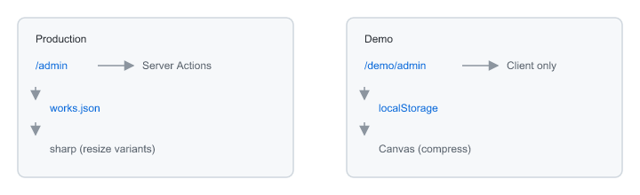
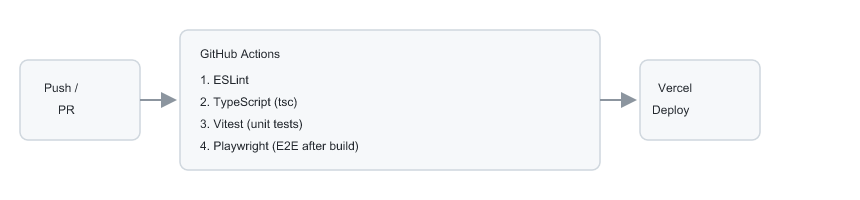

# Portfolio React

> **Legacy → Modern Migration Proof**  
> ほぼ Vanilla JS で構築されたレガシーポートフォリオを、**AI 駆動開発（Cursor / Claude）** で Next.js (App Router) へリプレイスした実証プロジェクトです。

| | レガシー | モダン（本リポジトリ） |
|---|---|---|
| **公開 URL** | [expogewinnt.github.io/portfolio/](https://expogewinnt.github.io/portfolio/) | [portfolio-react-202607.vercel.app/](https://portfolio-react-202607.vercel.app/) |
| **ソース** | [portfolio](https://github.com/expogewinnt/portfolio) | [portfolio-react](https://github.com/expogewinnt/portfolio-react) |
| **ホスティング** | GitHub Pages | Vercel + GitHub Actions |
| **フロントエンド** | Vanilla JS（静的 HTML / CSS / JS、UA 判定で PC / SP 分岐） | Next.js 16 / React 19 / TypeScript |
| **スタイル** | `css/`（PC / SP 別） | `app/globals.css`（レガシー CSS を統合移植） |
| **データ層** | `json/data.json`（XMLHttpRequest）+ `img/` | Server Component + microCMS（フォールバック: `works.json` / sharp） |
| **品質担保** | 手動確認 | Lint / 型検査 / Vitest / Playwright（CI 自動化） |

**移行で達成したこと**

- [x] 公開ギャラリーの UI/UX をレガシー版と同等に再現（hash ナビ・画像プリロード・サムネイル横スクロール）
- [x] 本番 API / ストレージを汚さない **デモモード**（`/demo`）— `localStorage` サンドボックス
- [x] `localStorage` 5MB 制限を前提とした **クライアント画像圧縮**（Canvas API — 720px / JPEG 70%）
- [x] 本番管理画面の認証分離（環境変数 + Cookie セッション）
- [x] Vercel 読み取り専用 FS を踏まえた **microCMS 連携**（自作 `/admin` UI 維持）
- [x] リプレイス後のデリバリー品質を CI/CD で担保

公開ギャラリーはレガシーからの **リプレイス**、管理画面・デモモードは移行先で **新規構築** した拡張です。  
第三者が本番データに触れずに **操作感・アーキテクチャ・リスク配慮** を確認できるよう、本番（`/admin`）とデモ（`/demo/admin`）を URL 単位で分離しています。

**AI 協働プロセスの詳細** → [AGENT.md](./AGENT.md)

---

## Features

### 1. デモモード（サンドボックス環境）

| ルート | 用途 | 認証 | データ保存先 |
|---|---|---|---|
| `/` | 本番ギャラリー | 不要 | microCMS（未設定時は `works.json` + 静的画像） |
| `/admin/**` | 本番管理 | 必須（Cookie セッション） | microCMS（未設定時は JSON + ファイル） |
| `/demo` | デモギャラリー | 不要 | ブラウザ `localStorage` |
| `/demo/admin/**` | デモ管理 | 不要 | ブラウザ `localStorage` |

**設計意図**

管理画面の動作を第三者に体験してもらう際、本番の `works.json` や画像ファイルを書き換えるリスクは許容できません。  
そこでデモモードでは、サーバーへの永続化を行わず、クライアントの `localStorage` にのみ状態を保持する **サンドボックス構成** としました。

- 初回アクセス時は `works.json` の直近 **20 件** をシードデータとして投入
- 画像アップロードは Canvas API で **横幅 720px / JPEG 70%** に圧縮し、Base64 Data URL として保存
- `QuotaExceededError`（localStorage 容量上限）を捕捉し、ユーザーへ明示的に通知
- 「リセット」操作で初期状態へ復帰可能

この設計により、**サーバーを汚さない**・**ブラウザの 5MB 制限内に収める**・**本番に影響なく CRUD を試せる** という三つの要件を同時に満たしています。



*図: 本番パス（Production / 左）とデモパス（Demo / 右）の責務分離*

| | 本番パス | デモパス |
|---|---|---|
| ルート | `/admin` | `/demo/admin` |
| 実行環境 | Server Actions | Client only |
| データ保存 | microCMS（フォールバック: `works.json`） | `localStorage` |
| 画像処理 | microCMS CDN / sharp | Canvas（圧縮） |

### 2. 本番管理画面の認証分離

本番管理の ID / パスワードは `.env.local` で管理し、リポジトリにはテンプレート（`.env.example`）のみを含めます。  
環境変数が未設定の場合はログインを無効化し、ハードコードされたフォールバック値は設けていません。

### 3. ギャラリー UI の共通化

`components/gallery-view.tsx` に表示ロジックを集約し、本番（`/`）とデモ（`/demo`）で同一 UI を再利用しています。  
デモ固有のデータソース差分は Context（`AdminGalleryProvider`）とカスタムフック（`useGalleryData`）で吸収しています。

### 4. microCMS 連携（本番データ層）

Vercel のファイルシステムは読み取り専用のため、本番の CRUD は **microCMS** を永続化先にします。  
自作の `/admin` UI と認証はそのまま維持し、データ層だけを差し替える構成です（デモモードは `localStorage` のまま変更なし）。

| 条件 | 保存先 |
|---|---|
| `MICROCMS_SERVICE_DOMAIN` + `MICROCMS_API_KEY` あり | microCMS（API ID: `works`） |
| 未設定 | 従来どおり `works.json` + `public/images/` + sharp（ローカル開発向け） |

- フィールド: `title` / `charge` / `image`
- 画像は Media API で 1 枚アップロードし、CDN クエリ（`?w=320` 等）でリサイズ
- 初回移行: `npm run migrate:microcms`（`works.json` → microCMS）
- Dashboard の Storage 表示で `microCMS` / `works.json` を確認可能

詳細手順 → [microcms-integration-plan.md](./microcms-integration-plan.md)

### 5. 本番画像パイプライン（local フォールバック / sharp）

microCMS 未設定時のローカル開発では、サーバー側で以下のバリアントを生成します。

| 用途 | 最大サイズ | 品質 |
|---|---|---|
| `big/`（PC 表示） | 1600px 幅 | JPEG 90% |
| `sp/`（スマホ） | 1200px 幅 | JPEG 88% |
| `small/`（サムネ） | 320×180（cover） | JPEG 86% |

デモと本番で画像処理の責務を明確に分離し、それぞれの制約に最適化しています。

---

## Tech Stack

### 移行後（本リポジトリ）

| カテゴリ | 技術 |
|---|---|
| Framework | Next.js 16（App Router） |
| UI | React 19 |
| Language | TypeScript 5.x |
| スタイル | グローバル CSS（`app/globals.css` — レガシー CSS 移植） |
| 本番 CMS | microCMS（環境変数で切替） |
| 画像処理（本番 / local） | sharp |
| 画像処理（本番 / microCMS） | Media API + CDN リサイズ |
| 画像処理（デモ） | Canvas API（クライアント） |
| 認証 | Cookie ベースセッション + 環境変数 |
| ホスティング | Vercel |
| CI/CD | GitHub Actions |
| Lint | ESLint（eslint-config-next） |
| テスト | Vitest（ユニット）/ Playwright（E2E スモーク） |
| Runtime | Node.js 20.9+（`.nvmrc` で固定） |

---

## Getting Started

### 前提

- Node.js 20.9 以上（`nvm use` 推奨）

### セットアップ

```bash
git clone git@github.com:expogewinnt/portfolio-react.git
cd portfolio-react
npm install

cp .env.example .env.local
# .env.local を編集
#   必須: ADMIN_USERNAME / ADMIN_PASSWORD / ADMIN_SESSION_TOKEN
#   任意: MICROCMS_SERVICE_DOMAIN / MICROCMS_API_KEY
#         （未設定なら works.json モードで動作）
```

microCMS を使う場合は、サービス側で API ID `works`（`title` / `charge` / `image`）を作成し、  
**読み取り + 書き込み + メディアアップロード** 権限の API キーを `.env.local` に設定してください。  
既存データの初回投入:

```bash
npm run migrate:microcms
```

### 開発サーバー

```bash
npm run dev
```

| URL | 説明 |
|---|---|
| http://localhost:3000 | 本番ギャラリー |
| http://localhost:3000/admin | 本番管理（要ログイン） |
| http://localhost:3000/demo | デモギャラリー |
| http://localhost:3000/demo/admin | デモ管理 |

`/admin` Dashboard の Storage が `microCMS`（または未設定時は `works.json`）になっていることを確認してください。

### スクリプト

```bash
npm run dev              # 開発サーバー
npm run build            # 本番ビルド（型チェック含む）
npm run start            # 本番サーバー
npm run lint             # ESLint
npm run typecheck        # TypeScript（tsc --noEmit）
npm run test             # Vitest（ユニットテスト）
npm run test:e2e         # Playwright（E2Eスモーク）
npm run migrate:microcms # works.json → microCMS 初回インポート
```

---

## 品質保証と CI/CD

`.github/workflows/ci.yml` で、push / PR 時に以下の品質ゲートを実行します。



*図: Push / PR → GitHub Actions（Lint / 型検査 / テスト）→ Vercel デプロイ*

| ジョブ | 実行内容 |
|---|---|
| **quality** | `npm run lint` → `npm run typecheck` → `npm run test` |
| **e2e** | `npm run build` → Playwright（`/` と `/demo` の表示スモーク） |

| レイヤー | 目的 |
|---|---|
| **Lint** | コーディング規約・潜在的バグの早期検出 |
| **Type check** | 型安全性の担保 |
| **Vitest** | ユーティリティ層の単体テスト（11 本） |
| **Playwright** | 公開・デモギャラリーの表示スモーク（1 本） |
| **Vercel** | main ブランチマージ後の自動デプロイ |

デモモードのような **クライアント完結型の機能** は、ブラウザ API（`localStorage` / Canvas）への依存が強いため、Vitest ではロジック層、Playwright では実ブラウザ上の動作を分担して検証する方針です。

---

## Future Architecture

現行の本番データ層は **microCMS**（未設定時のみ `works.json` フォールバック）です。  
Vercel 上でも `/admin` から CRUD 可能にし、デモモードで検証した UI はそのまま再利用しています。

さらなる要件が顕在化した際には、以下のような段階的移行を視野に入れています。

| フェーズ | 想定構成 | 移行トリガー |
|---|---|---|
| **現行** | Vercel + microCMS + GitHub Actions | 個人ポートフォリオ・低トラフィック |
| **Phase 1** | S3（静的アセット）+ CloudFront | 画像配信の CDN 最適化・帯域コスト管理 |
| **Phase 2** | AWS Amplify または ECS/Fargate | 認証基盤の強化・社内 SSO 連携 |
| **Phase 3** | RDS / DynamoDB + API Gateway | マルチユーザー管理・監査ログ要件 |

---

## Project Structure

```
app/
  page.tsx                 # 本番ギャラリー（Server Component）
  admin/                   # 本番管理（認証必須）
  demo/                    # デモギャラリー + デモ管理
components/
  gallery-view.tsx         # ギャラリー UI（本番・デモ共通）
  admin/                   # 管理画面コンポーネント
hooks/
  use-gallery-data.ts      # デモ用 CRUD + localStorage 永続化
lib/
  gallery-view-utils.ts    # hash ナビ・プリロード等（レガシー JS から移植）
  works-store.ts           # 本番データ層 facade（microCMS / local 切替）
  works-store-local.ts     # works.json + sharp（local フォールバック）
  microcms-client.ts       # microCMS CRUD + Media API
  cms-config.ts            # microCMS 設定判定
  gallery-storage.ts       # デモ用 localStorage 層
  gallery-image.ts         # デモ用クライアント画像圧縮
  admin-config.ts          # 認証設定（環境変数）
scripts/
  import-works-to-microcms.mjs  # 初回インポート
proxy.ts                   # 本番管理ルートの認証ガード
```

---

## 関連ドキュメント

- [AGENT.md](./AGENT.md) — AI 駆動開発の実証記録（レガシー解析・リスクヘッジ・CI/CD 構築プロセス）
- [gallery-localstorage-implementation-plan.md](./gallery-localstorage-implementation-plan.md) — デモモード実装の詳細計画書
- [microcms-integration-plan.md](./microcms-integration-plan.md) — microCMS 連携のセットアップ・切替手順
