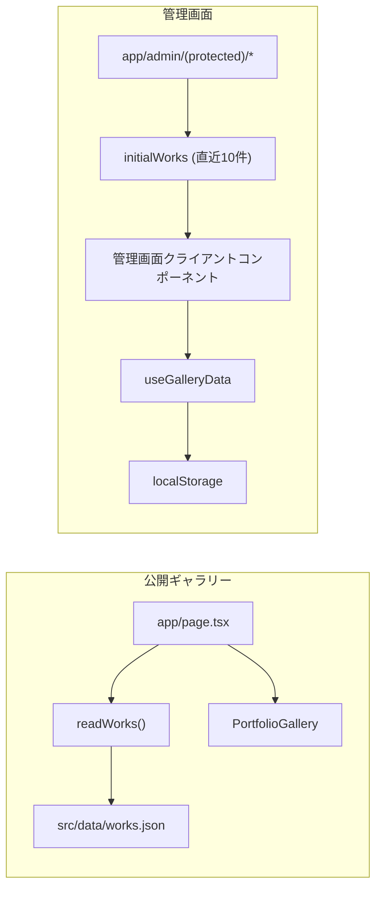

# ギャラリー管理画面 localStorage 化 実装計画

## 目的

採用担当者がポートフォリオの管理画面（ギャラリー操作）を安全に試せるように、管理画面のデータ保存先を一時的な `localStorage` に変更する。

公開ギャラリー本体には影響を与えず、管理画面内だけで追加・編集・削除・リセットを完結させる。

## 現状の構造

### 公開ギャラリー

- `app/page.tsx`
  - `readWorks()` で `src/data/works.json` を読み込む。
  - `PortfolioGallery` に作品データを渡す。
- `components/portfolio-gallery.tsx`
  - 公開ギャラリー表示を担当するクライアントコンポーネント。

### 管理画面

- `app/admin/(protected)/page.tsx`
  - ダッシュボード。
- `app/admin/(protected)/works/page.tsx`
  - 作品一覧。
- `app/admin/(protected)/works/new/page.tsx`
  - 新規作成画面。
- `app/admin/(protected)/works/[id]/page.tsx`
  - 編集画面。
- `app/demo/page.tsx`
  - 採用担当者向けデモギャラリー。
- `app/demo/admin/**`
  - 採用担当者向けデモ管理画面。
- `components/admin/work-editor-form.tsx`
  - 作品の作成・編集フォーム。
- `app/admin/actions.ts`
  - ログイン、ログアウトの Server Action。

### 現在のデータ層

- `lib/works-store.ts`
  - `server-only`。
  - `src/data/works.json` の読み書きを行う。
  - 画像ファイルを `public/images/{big,small,sp}/` に生成・削除する。
- `lib/admin-works.ts`
  - 管理画面向けに `readWorks()` の結果へ `id` を付与する。

## 変更後の構成



公開ギャラリーは従来通り `src/data/works.json` を読み取る。管理画面だけを `localStorage` ベースに変更する。

## 実装方針

### 1. 初期データのセット

初回アクセス時、`localStorage` に対象キーが存在しない場合は、サーバーから渡された既存データのうち **直近10件のみ** を初期値として保存する。

想定キー:

```ts
const GALLERY_STORAGE_KEY = "portfolio_admin_gallery_demo_v1";
```

初期値は `src/data/works.json` の内容を Server Component 側で読み込み、`getDemoInitialWorks()` で直近10件に絞ったうえで、クライアントコンポーネントへ `initialWorks` として渡す。

### 2. CRUD 操作

管理画面での CRUD はすべて `localStorage` 上のデータに対して行う。

| 操作 | 変更後の処理 |
| --- | --- |
| Create | 入力値と圧縮済み画像プレビューを `localStorage` の配列へ追加 |
| Read | `localStorage` から読み込み、管理画面に表示 |
| Update | 対象 ID の `ttl` / `charge` を更新 |
| Delete | 対象 ID のアイテムを配列から削除 |

`src/data/works.json` と `public/images/**` には書き込まない。

### 3. カスタムフック

状態管理と `localStorage` へのアクセス処理は、再利用可能なカスタムフックに切り出す。

想定ファイル:

```text
hooks/use-gallery-data.ts
components/admin/gallery-context.tsx
```

想定 API:

```ts
function useGalleryData(initialWorks: WorkItem[]) {
  return {
    works,
    siteTitle,
    isReady,
    getWorkById,
    setSiteTitle,
    createWork,
    updateWork,
    deleteWork,
    resetToInitial
  };
}
```

主な責務:

- 初回マウント後に `localStorage` を読み込む。
- キーが存在しない場合は直近10件の初期データを保存する。
- CRUD 後に React state と `localStorage` を同期する。
- Reset 時に初期データで上書きする。
- サイトタイトルも `localStorage` に保存する。

### 4. リセット機能

管理画面の片隅に「データを初期状態に戻す」ボタンを追加する。

想定配置:

- `components/admin/admin-shell.tsx` のサイドバー下部
- `Logout` ボタン付近
- `/demo/admin` のデモツールバー

実行時の処理:

1. `window.confirm` で確認する。
2. `localStorage` を初期データ（直近10件 + デフォルトタイトル）で上書きする。
3. 管理画面の状態を更新する。
4. 必要に応じて作品一覧へ遷移する。

### 5. ハイドレーションエラー対策

`localStorage` はサーバー側で参照できないため、初回レンダリングでは読み込まない。

安全な実装方針:

```ts
const [works, setWorks] = useState<AdminGalleryItem[]>([]);
const [isReady, setIsReady] = useState(false);

useEffect(() => {
  const data = loadOrSeedGallery(initialWorks);
  setWorks(data.works);
  setSiteTitle(data.siteTitle);
  setIsReady(true);
}, [initialWorks]);
```

`isReady === false` の間は、サーバーとクライアントの初回描画が一致するように、スケルトン UI またはローディング表示を出す。

### 6. 公開ギャラリーへの影響を避ける

以下のファイルは原則として変更しない。

- `app/page.tsx`
- `components/portfolio-gallery.tsx`
- `src/data/works.json`
- `public/images/**`

`lib/works-store.ts` は公開ギャラリー側の読み込みに使われているため、管理画面の `localStorage` 化のためには直接変更しない方針とする。

## 追加要件（採用担当者向けお試し機能）

### 追加要件1: タイトルの動的変更と Copyright 連動

- デモギャラリー画面（`/demo`）の左上サイトタイトルをクリックしてインライン編集できるようにする。
- 変更したタイトルは `localStorage` に保存する。
- 右下の `COPYRIGHT © 2026 [タイトル] ALL RIGHT RESERVED.` にリアルタイムで連動反映する。

想定コンポーネント:

- `components/admin/editable-site-title.tsx`
- `components/admin/admin-demo-gallery.tsx`

### 追加要件2: 画像の圧縮・リサイズ（QuotaExceededError 対策）

新規画像は Data URL 化の前に、Canvas API で以下を必ず実施する。

- 横幅最大 1000px にリサイズ
- JPEG 形式・画質 70% に圧縮

想定ファイル:

- `lib/gallery-image.ts`

### 追加要件3: デモモードの搭載と初期データの制限

- 初回アクセス時とリセット時は、95件すべてではなく **直近10件のみ** を初期データとして `localStorage` にセットする。
- 管理画面の目立つ場所に「採用担当者向けデモモード」表示とリセット導線を用意する。
- `/demo` で公開ギャラリーに近い操作体験を提供する。

想定定数:

```ts
const DEMO_WORKS_LIMIT = 10;
```

## 追加・変更予定ファイル

### 新規作成

| ファイル | 役割 |
| --- | --- |
| `hooks/use-gallery-data.ts` | 管理画面用の状態管理と `localStorage` CRUD |
| `lib/gallery-constants.ts` | ストレージキー、デモ件数、画像圧縮設定 |
| `lib/gallery-storage.ts` | `localStorage` 保存・復元ユーティリティ |
| `lib/gallery-utils.ts` | ID 付与、エスケープ、初期データ変換 |
| `lib/gallery-image.ts` | 画像圧縮・Data URL 化 |
| `components/admin/gallery-context.tsx` | 管理画面全体で共有する Context |
| `components/admin/gallery-reset-button.tsx` | リセットボタン |
| `components/admin/admin-works-list.tsx` | 管理画面の作品一覧クライアント UI |
| `components/admin/admin-dashboard-content.tsx` | ダッシュボードのクライアント UI |
| `components/admin/admin-demo-gallery.tsx` | デモギャラリー UI |
| `components/admin/editable-site-title.tsx` | インライン編集可能なサイトタイトル |
| `components/admin/admin-work-detail-page.tsx` | 編集画面のクライアントページ |

### 変更

| ファイル | 変更内容 |
| --- | --- |
| `components/admin/work-editor-form.tsx` | Server Action 依存から `useGalleryData` 利用へ変更 |
| `components/admin/admin-shell.tsx` | デモモード表示、リセットボタン、デモ導線を追加 |
| `app/admin/(protected)/layout.tsx` | `AdminGalleryProvider` で初期10件を供給 |
| `app/admin/(protected)/page.tsx` | `initialWorks` を渡す構成に変更 |
| `app/admin/(protected)/works/page.tsx` | クライアント一覧へ変更 |
| `app/admin/(protected)/works/new/page.tsx` | localStorage 版フォームへ変更 |
| `app/admin/(protected)/works/[id]/page.tsx` | クライアント側で作品取得する構成へ変更 |
| `app/admin/(protected)/demo/page.tsx` | デモギャラリー画面を追加 |
| `app/admin/actions.ts` | ログイン・ログアウトは維持し、作品 CRUD は削除 |

## 新規画像の扱い

既存画像は従来通り `/images/small/{img}` を参照する。

管理画面で新規追加した画像は、公開用画像ファイルとして保存せず、クライアント側でプレビュー用データとして扱う。

実装内容:

- Canvas API で横幅最大 1000px にリサイズする。
- JPEG 形式・画質 70% に圧縮する。
- `previewUrl` として `localStorage` に保存する。

表示時は以下の優先順位で画像を出す。

```ts
const imageSrc = work.previewUrl ?? `/images/small/${work.img}`;
```

## localStorage 保存形式

```ts
type GalleryStorageState = {
  works: AdminGalleryItem[];
  siteTitle: string;
};
```

## 実装順序

1. `lib/gallery-constants.ts` / `lib/gallery-utils.ts` / `lib/gallery-storage.ts` / `lib/gallery-image.ts` を作成する。
2. `hooks/use-gallery-data.ts` と `components/admin/gallery-context.tsx` を実装する。
3. `components/admin/gallery-reset-button.tsx` とデモ UI を作成する。
4. 管理画面の一覧・ダッシュボード・編集画面をクライアントコンポーネント化する。
5. Server Component 側は `initialWorks`（直近10件）を渡すだけの構成に変更する。
6. 作品 CRUD の Server Action 依存を整理する。
7. 動作確認を行う。

## 動作確認項目

- 初回アクセス時に `localStorage` へ直近10件の初期データが保存される。
- 一覧表示が `localStorage` の内容を参照している。
- 作品を追加できる。
- 作品を編集できる。
- 作品を削除できる。
- リセットボタンで初期状態（直近10件）に戻る。
- リロード後も管理画面の変更内容が保持される。
- デモギャラリーでサイトタイトルをインライン編集できる。
- Copyright 表示がタイトル変更に連動する。
- 新規画像が 1000px / JPEG 70% で圧縮される。
- 公開ギャラリー `/` の表示が変わらない。
- `src/data/works.json` が変更されない。
- `public/images/**` が変更されない。
- ハイドレーションエラーが発生しない。

## 想定される課題と対応策

| 課題 | 対応策 |
| --- | --- |
| `localStorage` の容量制限 | 新規追加画像を 1000px / JPEG 70% に圧縮して保存する |
| SSR と `localStorage` の不一致 | `useEffect` 後に読み込み、初回はローディング表示にする |
| 既存 Server Action 構成との差分 | 認証は Server Action のまま維持し、作品 CRUD のみクライアント化する |
| 公開ギャラリーへの混入 | 公開側のファイルは変更せず、管理画面専用フックに閉じ込める |
| Reset の基準 | ページロード時にサーバーから渡された `works.json` の直近10件を初期状態として扱う |
| 初期データが多すぎる | `DEMO_WORKS_LIMIT = 10` で初回・リセット時の件数を制限する |

## 事前確認事項（承認済み）

1. 管理画面のみ `localStorage` 化し、公開ギャラリーは変更しない方針でよいか。 → **YES**
2. 新規追加画像は公開用ファイルに保存せず、`localStorage` 上のプレビューとして扱う方針でよいか。 → **YES**
3. Reset は `src/data/works.json` の現行内容へ戻す方針でよいか。 → **YES**（直近10件に限定）
4. CRUD の Server Action は作品操作では使用しない構成に整理してよいか。 → **YES**
